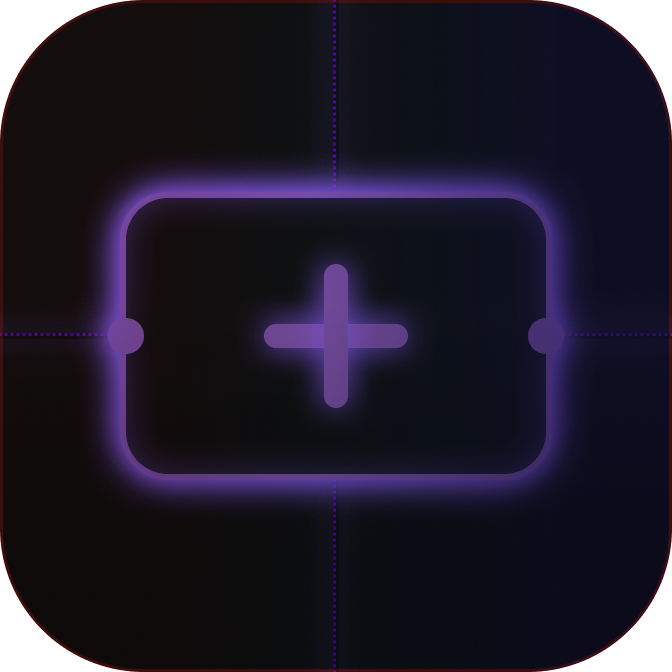

<p align="center">
  
</p>

# 🎨 TokenzUnfold


An intelligent Figma plugin that automatically generates design annotations for components and layers. It extracts styles (tokens), variables, and properties, then "unfolds" them into clean, themed tags with smart, orthogonal connectors.

---

## ✨ Key Features

-   **⚡ Automatic Extraction**: Instantly captures Colors (Variables & Styles), Typography, Component States, Effects (Shadows), Border Radius, and Layout Padding.
-   **🔗 Smart Connectors**: Draws professional, orthogonal L-shaped connectors with rounded corners that stay organized.
-   **🧹 Clean Layout**: Automatically places annotations at the edges of the frame using zone-based logic to prevent overlap.
-   **👯 Deduplication**: Smartly detects identical components and links them to a single annotation tag to reduce clutter.
-   **🎨 Dynamic Theming**: Supports **Dark**, **Light**, and **Blueprint** themes with real-time updating of existing annotations.
-   **🧩 Component Grouping**: Heuristically groups related child nodes (like a text label inside a button) into a single unified annotation.

---

## 🛠️ Tech Stack

-   **Frontend**: React + Vite (for a responsive UI).
-   **Plugin Logic**: TypeScript (fully modularized for maintainability).
-   **Build Tool**: Esbuild (for fast main thread bundling).
-   **Styling**: Vanilla CSS.

---
## Demo


https://github.com/user-attachments/assets/f01f6483-f988-445a-9916-ad2c1f649937


## 🚀 Getting Started

### Prerequisites

-   [Node.js](https://nodejs.org/) (v16 or higher)
-   [Figma Desktop App](https://www.figma.com/downloads/)

### Installation

1.  **Clone the Repository**
    ```bash
    git clone https://github.com/mohamedshemees/TokenzUnfold.git
    cd TokenzUnfold
    ```

2.  **Install Dependencies**
    ```bash
    npm install
    ```

3.  **Build the Project**
    ```bash
    npm run build
    ```

### Loading into Figma

1.  Open Figma and navigate to **Plugins** -> **Development** -> **Import plugin from manifest...**.
2.  Select the `manifest.json` file in the project root.
3.  The plugin is now ready to use under your "Development" plugins!

---

## 📖 Usage Guide

1.  **Select Designs**: Select one or more frames, components, or layers you want to annotate.
2.  **Open Plugin**: Launch "TokenzUnfold" from the plugins menu.
3.  **Configure Options**: Toggle which properties you want to extract (Colors, Typography, etc.).
4.  **Pick a Theme**: Choose between Dark, Light, or Blueprint styles.
5.  **Annotate**: Click **Annotate Selection**. The plugin will calculate the best placement and draw the connectors automatically.

---

## 🤝 Contributing

We love contributions! Here’s how you can help:

1.  **Fork** the repository.
2.  Create a **new branch** (`git checkout -b feature/amazing-feature`).
3.  **Commit** your changes (`git commit -m 'Add some amazing feature'`).
4.  **Push** to the branch (`git push origin feature/amazing-feature`).
5.  Open a **Pull Request**.

### Code Structure
The plugin logic is located in `src/main/` and is split into specialized modules:
-   `traversal.ts`: Logic for scanning Figma nodes.
-   `annotations.ts`: Tag creation and data management.
-   `connectors.ts`: Geometric logic for drawing lines.
-   `layout.ts`: Sorting and collision avoidance.

---

## 🐛 Raising Issues

Found a bug or have a feature request? Let us know!

1.  Go to the [Issues](https://github.com/mohamedshemees/TokenzUnfold/issues) tab.
2.  Search if a similar issue already exists.
3.  If not, click **New Issue**.
4.  Include a clear description, steps to reproduce, and screenshots if applicable.


*Handcrafted with ❤️ to make design handoff a breeze.*
